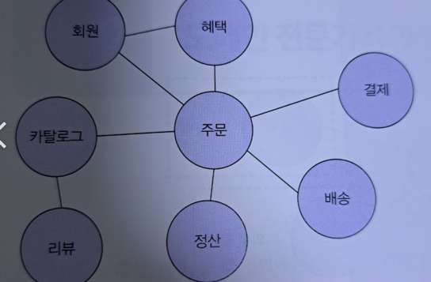
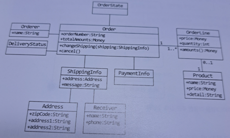
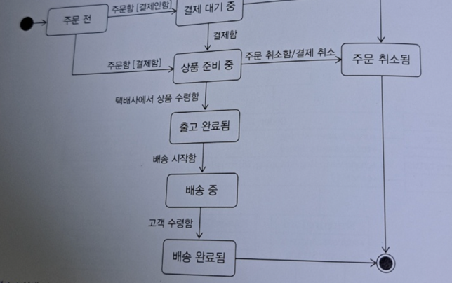

# 1. 도메인 모델 시작하기.

## 1.1 도메인이란?

책을 구매할 떄 어떤 책이 나왔는지 검색하고, 목차와 서평을 보고,

이 책은 어떤 책일지 가늠해 보고. 읽고 싶은 책이 있으면 나중에 사기 위해 장바구니에 담거나 바로 구매할 수도 있다.

싸게 살 수 있는 쿠폰이 있는지 찾아보기도 한다. 간편 결제, 외부 서비스 사용을 통해 결제하고

구매한 뒤에 언제 책을 받을 수 있는지 추적을 할 수 도 있다.

개발자 입장으로 본다면 서점은 구현해야할 소프트웨어이다. **상품 조회, 구매, 결제, 배송 추적** 등의 기능을 제공해야 한다.



카탈로그 하위 도메인은 고객에게 구매 가능한 상품 목록을 제공, 주문 하위 도메인은 고객의 주문을 처리.

혜택 하위 도메인은 쿠폰이나 할인과 같은 서비스를 제공한다. 한 하위 도메인은 다른 하위 도메인과 연동하여 완전한 기능을 제공.

특정 도메인을 위한 소프트웨어라고 해서 도메인이 제공해야 할 모든 기능을 직접 구현하는 것은 아니다.

외부 시스템을 사용하는 경우도 있기 떄문이다.

## 1.2 도메인 전문가와 개발자 간 지식 공유

홍보나 정산, 배송 등의 영역에는 전문가가 있고 이들 전문가는 해당 도메인에 대한 지식과 경험을 바탕으로 본인들이 원하는 기능 개발을 요구한다.

회계 담당자는 엑셀로 맞추던 정산 금액 계산을 자동화해 주는 기능을 요구할 수 있다.

AS 기사는 고객에게 보내는 문자 메세지를 빠르게 입력할 수 있는 템플릿 추천 기능을 요구할 수 있다.

개발자는 이런 요구사항을 분석하고 설계하여 코드를 작성하며 테스트, 배포가 가능하다.

만약 요구사항을 올바르게 이해하지 않으면 엉뚱한 기능을 구현하게 된다.

요구사항을 제대로 이해하기 위해서는 개발자와 전문가가 직접 대화하는 것이 중요하다.

개발자와 전문가 사이에 내용을 전파하는 전달자가 많으면 많을수록 정보가 왜곡되고 손실이 발생한다.

개발자도 어느정도의 도메인 지식을 갖춰야 한다. 제품 개발과 관련된 도메인 전문가, 관계자, 개발자가 같은 지식을 공유하가 직접 소통할수록 도메인전문가가 원하는 제품을 만들 확률이 올라간다.

### Garbage in Garbage Out

잘못된 값이 들어가면 잘못된 결과가 나온다는 뜻이다. 요구사항을 잘못 이해하면 출력값도 잘못된 값으로 나오기 떄문에 개발자와 도메인 전문가와의 의사소통이 중요하다.

## 1.3 도메인 모델

도메인 모델에는 다양한 정의가 존재한다. 기본적으로 도메인 모델은 특정 도메인을 개념적으로 표현한 것이다.

주문 모델을 객체 모델로 구성하면 밑과 같은 이미지 처럼 된다.



주문(Order)은 주문번호(orderNumber)와 지불할 총금액(totalAmounts)이 있고 배송정보(ShippingInfo)를 변경(changeShipping)을 할 수 있다.

또한 주문을 취소 할 수 있다는 것도 알 수 있다. 도메인 모델을 사용하면 여러 관계자들이 동일한 모습으로 도메인을 이해하고 도메인 지식을 공유하는 데 도움이 된다.

객체를 이용한 도메인 모델이다.

도메인을 이해하려면 도메인이 제공하는 기능과 도메인이 주요 데이터를 구성해야 하는데 이런 면에서 기능과 데이터를 함께 보여주는 객체 모델은
도메인 모델링하기에 적합하다.



객체로만 모델링을 할 수 있는 것은 아니다. 상태 다이어그램을 통해 주문의 상태 전이를 모델링하고 있다.

도메인 모델은 기본적으로 도메인 자체를 이해하기 위한 개념 모델이다. 개념 모델을 이용해서 바로 코드를 작성할 수 있는 것은 아니기에 구현 기술에 맞는 구현 모델이 따로 필요하다.

개념 모델과 구현 모델은 서로 다른 것이지만 구현 모델이 개념 모델을 최대한 따르도록 할 수는 있다.

## 1.4 도메인 모델 표현

일반적인 어플리케이션의 아키텍처는 네 개의 영역으로 구성된다.

표현 - 응용 - 도메인 - 인프라스트럭처

| 영역             | 설명                                                                |
|----------------|-------------------------------------------------------------------|
| 사용자 인터페이스 / 표현 | 사용자의 요청을 처리하고 사용자에게 정보를 보여준다. 소프트웨어를 사용하는 사람뿐만 아니라 외부 시스템일 수도 있다. |
| 응용             | 사용자가 요청한 기능을 실행한다. 업무 로직을 직접 구현하지 않아도 되며 도메인 계층을 조합해서 기능을 실행한다.   |
| 도메인            | 시스템이 제공할 도메인 규칙을 구현한다.                                            |
| 인프라스트럭처        | 데이터베이스나 메세징 시스템과 같은 외부 시스템과의 연동을 처리한다.                            |

지금까지는 도메인 자체를 이해하는 데 필요한 개념 모델을 의미한다면. 지금은 도메인 모델 패턴을 의미한다.

도메인 모델은 아키텍처 상의 도메인 계층을 객체 지향 기법으로 구현하는 패턴을 의미한다.

도메인 계층은 도메인의 핵심 규칙을 구현한다. 
주문 도메인의 경우 출고 전에 배송지를 변경 할 수 있다는 규칙과 주문 취소는 배송 전에만 할 수 있다 라는 규칙을
구현한 코드가 도메인 계층에 위치하게 된다.

이런 도메인 규칙을 객체 지향 기법으로 구현하는 패턴이 도메인 모델 패턴이다.

```java
public class Order {
    private OrderState state;
    private ShippingInfo shippingInfo;
    
    public void changeShippingInfo(ShippingInfo newShippingInfo) {
        if (!state.isShippingChangeable()) {
            throw new IllegalStateException("can`t change Shipping in " + state);
        }
        this.shippingInfo = newShippingInfo;
    }
    
}

public enum OrderState {
    PAYMENT_WAITING {
        public boolean isShippingChangeable() {
            return true;
        }
    },
    PREPARING {
        public boolean isShippingChangeable() {
            return true;
        }
    },
    SHIPPED, DELIVERING, DELIVERY_COMPLETED;

    public boolean isShippingChangeable() {
        return false;
    }
}
```

이 코드는 주문 도메인의 일부 기능을 도메인 모델 패턴으로 구현한 것이다.

OrderState 는 배송지를 변경할 수 있는지를 검사하는 isShippingChangeable() 메서드를 제공하고 있다.

큰 틀에서 보면 OrderState 는 Order 에 속한 데이터이므로 배송지 정보 변경 가능 여부를 판단하는 Order로 이동할 수 있다.

```java
public class Order {
    private OrderState state;
    private ShippingInfo shippingInfo;

    public void changeShippingInfo(ShippingInfo newShippingInfo) {
        if (!state.isShippingChangeable()) {
            throw new IllegalStateException("can`t change Shipping in " + state);
        }
        this.shippingInfo = newShippingInfo;
    }

    private boolean isShippingChangeable() {
        return state == OrderState.PAYMENT_WAITING || state == OrderState.PREPARING;
    }
}

public enum OrderState {
    PREPARING, PAYMENT_WAITING, SHIPPED, DELIVERING, DELIVERY_COMPLETED;
}
```

배송지 변경이 가능한지를 판단할 규칙이 주문 상태와 다른 정보를 함께 사용한다면 OrderState 만으로는 배송지 변경 가능 여부를 판단할 수 없으므로

Order 에서 로직을 구현해야 한다.

배송지 변경 가능 여부를 판단하는 기능이 Order 에 있든 OrderState 에 있든 중요한 점은 주문과 관련된 중요 업무 규칙을 주문 도메인 모델인
Order 나 OrderState 에서 구현한다는 점이다.

핵심 규칙을 구현한 코드는 도메인 모델에만 위치하기 때문에 규칙이 바뀌거나 규칙을 확장해야 할 때 다른 코드에 영향을 덜 주고 변경 내역만 모델에 반영할 수 있다.

두 번째 방법은 DDD 와는 잘 안맞는 느낌이다.

### 문제점.

isShippingChangeable() 메서드가 Order 클래스에 정의되어 있으며, 

이 메서드가 상태에 따른 로직을 처리하고 있습니다. 이는 상태 변화에 대한 로직이 OrderState가 아닌 Order에 포함된 것이므로,

응집성이 떨어지고 유지보수가 어려워질 수 있습니다.

### DDD 관점.

도메인 로직이 흩어져 있는 상황이므로, 상태에 따라 동작하는 로직은 상태 자체에 포함시키는 것이 더 적절합니다.

또한, 상태에 따른 변경 규칙을 OrderState에 두지 않고 Order에서 처리하는 것은 객체가 자신의 상태를 알지 못하는 것처럼 보입니다.


----------------------

## 1.5 도메인 모델 도출

도메인을 모델링할 때 기본이 되는 작업은 모델을 구성하는 핵심 구성요소 규칙 기능을 찾는 것이다. 이 과정은 요구사항에서 출발한다.

주문 도메인과 관련된 몇 가지 요구사항을 본다.

- 최소 한 종류 이상의 상품을 주문해야 한다.
- 한 상품을 한 개 이상 주문할 수 있다.
- 총 주문 금액은 각 상품의 구매 가격 합을 모두 더한 금액이다.
- 각 상품의 구매 가격 합은 상품 가격에 구매 개수를 곱한 값이다.
- 주문할 때 배송지 정보를 반드시 지정해야 한다.
- 배송지 정보는 받는 사람 이름, 전화번호, 주소로 구성된다.
- 출고를 하면 배송지를 변경할 수 없다.
- 출고 전에 배송을 취소할 수 있다.
- 고객이 결제를 완료하기 전에는 상품을 준비하지 않는다.

주문은 '출고 상태로 변경', '배송지 정보 변경', '주문 취소', '결제 완료' 기능을 제공한다.

Order 의 관련 기능을 메서드로 추가할 수 있다.

```java
public class Order {
    public void changeShipped() {...}

    public void changeShippingInfo(ShippingInfo shippingInfo) {...}

    public void cancel() {...}

    public void completePayment() {...}
}
```

또한 주문 항목이 어떤 데이터로 구성되었는지 알려준다.

- 한 상품을 한 개 이상 주문할 수 있다.
- 각 상품의 구매 가격 합은 상품 가격에 구매 개수를 곱한 값이다.

주문 항목을 표현하는 OrderLine은 적어도 주문할 상품, 가격, 구매 개수를 포함해야 한다. 추가로 각 구매 항목의 구마 가격도 제공해야 한다.

```java
public class OrderLine {
    private Product product;
    private int price;
    private int quantity;
    private int amounts;

    public OrderLine(Product product, int price, int quantity) {
        this.product = product;
        this.price = price;
        this.quantity = quantity;
        this.amounts = calculateAmounts();
    }

    private int calculateAmounts() {
        return price * quantity;
    }
    
    public int getAmounts() {...}
}
```

OrderLine 은 한 상품을 얼마에 몇 개 살지를 담고있고 calculateAmounts 메서드로 구매 가격을 구하는 로직을 구현하고 있다.

다음은 Order 와 OrderLine 과의 관계를 알려준다.

- 최소 한 종류 이상의 상품을 주문해야 한다.
- 총 주문 금액은 각 상품의 구매 가격 합을 모두 더한 금액이다.

한 종류 이상의 상품을 주문할 수 있으므로 Order는 최소 한 개 이상의 OrderLine 을 포함해야 한다.

```java
public class Order {
    private List<OrderLine> orderLines;
    private Money totalAmounts;

    public Order(List<OrderLine> orderLines) {
        setOrderLines(orderLines);
    }

    private void setOrderLines(List<OrderLine> orderLines) {
        verifyAtLeastOneOrMoreOrderLines(orderLines);
        this.orderLines = orderLines;
        calculateTotalAmounts();
    }

    private void verifyAtLeastOneOrMoreOrderLines(List<OrderLine> orderLines) {
        if (orderLines == null || orderLines.isEmpty()) {
            throw new IllegalArgumentException("no Orders");
        }
    }

    private void calculateTotalAmounts() {
        int sum = orderLines.stream().mapToInt(x -> x.getAmounts()).sum();
        this.totalAmounts = new Money(sum);
    }
}
```

Order 는 한 개 이상의 OrderLine 을 가질 수 있으므로 Order 를 생성할 떄 OrderLine 목록을 List 로 전달.

setOrderLines 메서드로 요구사항에 정의한 제약 조건을 검사한다.

배송지 정보는 이름, 전화번호, 주소 데이터를 가지므로 ShippingInfo 클래스를 다음과 같이 정의할 수 있다.

```java
public class ShippingInfo {
    private String receiverName;
    private String receiverPhoneNumber;
    private String shippingAddress1;
    private String shippingAddress2;
    private String shippingZipcode;
}
```

주문할 때 배송지 정보를 반드시 지정해야 한다라는 내용이 있으므로 Order 를 생성할 때 ShippingInfo 도 함께 전달해야 한다.

```java
public class Order {
    private List<OrderLine> orderLines;
    private Money totalAmounts;
    private ShippingInfo shippingInfo;

    public Order(List<OrderLine> orderLines, ShippingInfo shippingInfo) {
        setOrderLines(orderLines);
        setShippingInfo(shippingInfo);
    }

    private void setOrderLines(List<OrderLine> orderLines) {
        verifyAtLeastOneOrMoreOrderLines(orderLines);
        this.orderLines = orderLines;
        calculateTotalAmounts();
    }
    
    private void setShippingInfo(ShippingInfo shippingInfo) {
        if (shippingInfo == null) {
            throw new IllegalArgumentException("no info");
        }
        this.shippingInfo = shippingInfo;
    }

    private void verifyAtLeastOneOrMoreOrderLines(List<OrderLine> orderLines) {
        if (orderLines == null || orderLines.isEmpty()) {
            throw new IllegalArgumentException("no Orders");
        }
    }

    private void calculateTotalAmounts() {
        int sum = orderLines.stream().mapToInt(x -> x.getAmounts()).sum();
        this.totalAmounts = new Money(sum);
    }
}
```

도메인을 구현하다 보면 특정 조건이나 상태에 따라 제약이나 규칙이 달리 적용되는 경우가 많다. 주문 요구사항에서는 다음 내용이 제약과 규칙에 해당한다.

- 출고를 하면 배송지 정보를 변경할 수 없다.
- 출고 전에 주문을 취소 할 수 있다.

이 요구사항은 출고 상태가 되기 전과 후의 제약사항을 기술한다. 출고 상태에 따라 배송지 정보 변경 기능과 취소 기능은 다른 제약을 갖는다.

또한 이 요구사항도 상태와 관련이 있다.

- 고객이 결제를 완료하기 전에는 상품을 준비하지 않는다.

```java
public enum OrderState {
    PREPARING, PAYMENT_WAITING, SHIPPED, DELIVERING, DELIVERY_COMPLETED, CANCELED
}
```

```java
public class Order {
    private OrderState state;

    public void changeShippingInfo(ShippingInfo newShippingInfo) {
        verityNotYetShipped();
        setShippingInfo(newShippingInfo);
    }

    public void cancel() {
        verityNotYetShipped();
        this.state = OrderState.CANCELED;
    }

    private void verityNotYetShipped() {
        if (state != OrderState.PAYMENT_WATING && state != Order.PREPARING) {
            throw new IllegalStateException("aleady shipped");
        }
    }

}
```

-------------------------------

## 1.6 엔티티와 벨류

도출한 모델은 엔티티와 벨류로 구분할 수 있다.

엔티티와 밸류를 제대로 구분하여 도메인을 올바르게 설계하고 구현할 수 있기 떄문에 이 둘의 차이를 명확하게 이해하는 것은
도메인을 구현하는데 있어 중요하다.

### 1.6.1 엔티티

엔티티의 가장 큰 특징은 식별자를 가진다는 것이다. 식별자는 엔티티 객체마다 고유해서 각 엔티티는 서로 다른 식별자를 갖는다.

예를 들어 주문 도메인에서 각 주문은 주문번호를 가지고 있는데 이 주문번호는 각 주문마다 서로 다르다. 따라서 주문번호가 주문의 식별자가 된다.

```java
public class Order {
    private String orderNumber;
}
```

주문에서 배송지 주소가 바뀌거나 상태가 바뀌더라도 주문번호는 불변한다.
엔티티의 식별자는 고유하기 떄문에 두 엔티티 객체의 식별자가 같으면 두 엔티티는 같다고 판단할 수 있다.

### 1.6.3 밸류 타입

ShippingInfo 클래스는 받는 사람과 주소에 대한 데이터를 갖고 있다.

```java
public class ShippingInfo {
    private String receiverName;
    private String receiverPhoneNumber;

    private String shippingAddress1;
    private String shippingAddress2;
    private String shippingZipcode;
}
```

receiverName, receiverPhoneNumber 필드는 서로 다른 두 데이터를 담고 있지만 개념적으로 받는 사람을 의미한다.

즉 두 필드는 실제로 하나의 개념을 표현중이다.

받는 사람을 위한 밸류 타입인 Receiver 라는 값을 만들수 도 있다는 것이다.

밸류 타입의 또 다른 장점은 밸류 타입을 위한 기능을 추가할 수 있다는 점이다.

```java
public class Money {
    private int value;
    
    public Money add(Money money) {
        return new Money(this.value + money.value);
    }
    
    public Money multipy(int multiplier) {
        return new Money(value * multiplier);
    }
}
```

Money 처럼 데이터 변경 기능을 제공하지 않는 타입을 불변이라 한다.

### 1.6.4 엔티티 식별자와 밸류 타입

엔티티 식별자의 실제 데이터는 String 과 같은 문자열로 구성된 경우가 많다. 신요아드 번호도 16개의 숫자로 구성된 문자열이며
많은 온라인 서비스에서 회원을 구분할 때 사용하는 이메일 주소도 문자열이다.

단순 숫자가 아닌 도메인의 돈을 의미하는 것처럼 이런 식별자는 단순한 문자열이 아니라 도메인에서 특별한 의미를 지니는 경우가 많기 떄문에

식별자를 위한 밸류 타입을 사용해서 의미가 잘 드러나도록 할 수 있다.

Order 의 식별자 타입으로 String 대신 OrderNo 밸류 타입을 사용하면 타입을 통해 해당 필드가 주문번호라는 것을 알 수 있다.

```java
public class Order {
    private OrderNo id;

    public OrderNo getId() {
        return id;
    }
}
```

이렇게 식별자를 밸류타입으로 만들면 어떤 장점이 있는가?

1. 의미적 명확성을 가지게 됩니다.
2. 불변성과 일관성을 가지게 됩니다.
3. 식별자를 Value Object로 관리함으로써, 식별자 생성 규칙이나 검증 로직을 Value Object 안에 캡슐화할 수 있습니다.
4. 타입 안전성을 가지게 됩니다.

### 1.6.5 도메인 모델에 set 메서드 넣지 않기

get / set 메서드를 습관적으로 추가할 때가 있는데. 도메인 모델에서는 무조건 추가하는 것은 좋지 않은 버릇이다.

```java
public class Order {
    public void setShippingInfo(ShippingInfo newShipping) { ... }
    public void setOrderState(OrderState state) { ... }
}
```

setShippingInfo 메서드는 단순히 배송지 값을 설정하는 것을 의미한다.

completePayment 는 결제를 완료했다는 의미를 갖는 반면에 setOrderState 는 단순히 주문 상태 값을 변경하는 것만 의미한다.

결제 완료 처리를 구현하니까 completePayment 로 구현하는 것이 자연스럽다.

setOrderState 는 단순히 상태 값만 변경할지 아니면 상태값에 따라 다른 처리를 위한 코드를 함께 구현할지 애매하다.

### 요약. 특별한 이유 없다면 불변 타입의 장점을 살릴 수 있도록 밸류 타입은 불변으로 구현해야 한다.

----------------------------

## 1.7 도메인 용어와 유비쿼터스 언어

코드를 작성할 때 도메인에서 사용하는 용어는 매우 중요하다. 도메인에서 사용하는 용어를 코드에 반영하지 않으면

그 코드는 개발자에게 코드의 의미를 해석해야 하는 부담을 준다.

최대한 도메인 용어를 사용해서 도메인 규칙을 코드로 작성하게 되므로 버그도 줄어들게 된다.

에릭 에반스는 도메인 주도 설계에서 언어의 중요함을 강조하기 위해 유비쿼터스 언어라는 용어를 사용했다.

전문가, 관계자, 개발자가 도메인과 관련된 공통의 언어를 만들고 이를 대화, 문서, 도메인 모델, 코드, 테스트 등 모든 곳에서
같은 용어를 사용하여 불필요한 해석 과정을 줄일 수 있다고 한다.

